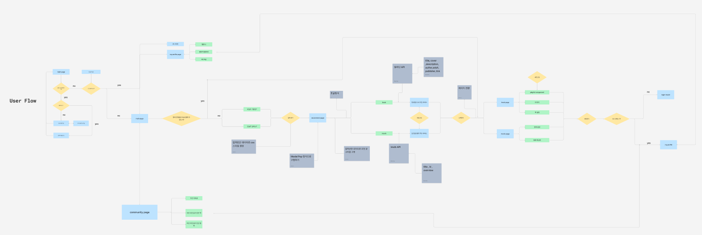
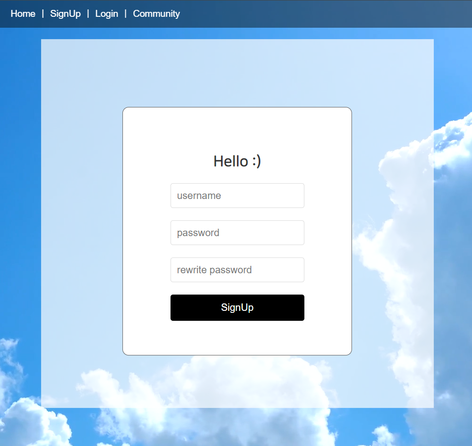
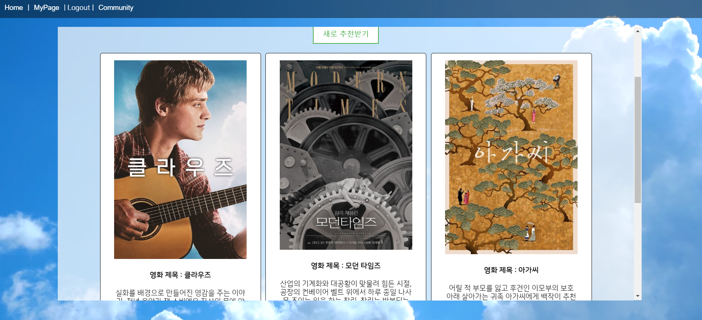

# 6조 핫식스 최종 관통 프로젝트

## 문화 장려 프로젝트 🐱‍🏍

- 목적 : 사용자에게 책과 영화를 추천해주는 사이트를 통해 사용자들의 문화 생활 독려. 그저 추천만 해주는게 아닌 사용자의 문화 생활을 기록해주는 서비스. 이를 통해 성취감과 랭킹 시스템의 경쟁을 통해 독려 가능!!


### 목차
- [6조 핫식스 최종 관통 프로젝트](#6조-핫식스-최종-관통-프로젝트)
  - [문화 장려 프로젝트 🐱‍🏍](#문화-장려-프로젝트-)
    - [목차](#목차)
  - [1. 팀원 정보 및 업무 분담 내역](#1-팀원-정보-및-업무-분담-내역)
    - [🖥 기술 스택](#-기술-스택)
    - [정진영](#정진영)
      - [Front End](#front-end)
      - [Back End](#back-end)
      - [그 외](#그-외)
    - [김민수](#김민수)
      - [Front End](#front-end-1)
      - [Back End](#back-end-1)
      - [그 외](#그-외-1)
  - [2. 목표 서비스 구현 및 실제 구현 정도](#2-목표-서비스-구현-및-실제-구현-정도)
  - [3. 데이터베이스 모델링 (ERD)](#3-데이터베이스-모델링-erd)
    - [user flow (by 진영)](#user-flow-by-진영)
    - [Vue Components tree (by 민수)](#vue-components-tree-by-민수)
    - [사이트 목업 (by 진영)](#사이트-목업-by-진영)
    - [ERD (by 민수)](#erd-by-민수)
  - [4. 영화 추천 알고리즘에 대한 기술적 설명](#4-영화-추천-알고리즘에-대한-기술적-설명)
  - [5. 핵심 기능에 대한 설명](#5-핵심-기능에-대한-설명)
    - [1️⃣ 메인 페이지](#1️⃣-메인-페이지)
    - [2️⃣ 로그인, 회원가입 페이지](#2️⃣-로그인-회원가입-페이지)
    - [3️⃣ 기분 선택 페이지](#3️⃣-기분-선택-페이지)
    - [4️⃣ greeting 페이지](#4️⃣-greeting-페이지)
    - [5️⃣ 추천 페이지](#5️⃣-추천-페이지)
    - [6️⃣ 책 추천 페이지](#6️⃣-책-추천-페이지)
    - [7️⃣ 영화 추천 페이지](#7️⃣-영화-추천-페이지)
    - [8️⃣ 리뷰](#8️⃣-리뷰)
    - [9️⃣ My Page](#9️⃣-my-page)
    - [🔟 Community 페이지](#-community-페이지)
  - [6. 기타 (느낀점, 후기 등)](#6-기타-느낀점-후기-등)
    - [정진영](#정진영-1)
    - [김민수](#김민수-1)


## 1. 팀원 정보 및 업무 분담 내역
- 2024/05/10 ~ 2024/05/23 

### 🖥 기술 스택
**🌕 front**

- language
    - javascript
- framework
    - Vue3
    - pinia (+pinia-plugin-persistedstate)
    - store
    - axios

**🌑 back**

- language
    - python
- framework
    - django
    - django-rest-framework
    - dj-rest-auth

<br>

### 정진영

#### Front End
- 메인 페이지 구축
  - 로그인, 회원가입, store를 통한 회원 관련 중앙 저장소 생성
  - Router Navigation Guard 를 통해 현재 로그인 유저는 회원가입 페이지 이동 X
  - 날씨 배경 적용 👍
- 회원가입, 로그인 페이지 생성 및 구현
- 유저 페이지 작성 및 기능 구현
  - 모달로 모든 CRUD를 구현하는 과정에서 CSS 적인 부분에서 많이 시간이 걸린 것 같다.
  - 특히 팔로우/ 언팔로우 기능과 리뷰 수정 후 모달 내용이 변화되지 않는 하루가 있었는데, 그날 집에 가기 전에 해결했던 것이 가장 기억에 남을 것 같다. 
- Weather API 를 통한 현재 위치에 따른 날씨 정보 관련 store 생성 및 저장

#### Back End
- Django : BOOk, MOVIE, REVIEW CRUD 관련 작성 및 수정
  - 참조 관계를 생각하면서 처음에 모델 관계를 설정하는 것이 가장 어려웠다.
  - 결과적으로는 처음부터 잘 짜여지면 좋지만, Vue 에서 기능 구현을 하면서 수정을 반복하는 것이 개발 프로젝트의 핵심이라는 것을 배우게 되었다.

- Chat GPT API 를 통한 환영 인사 제공 및 장르 추천 프롬프트 작성
- Youtube API, TMDB API, 알라딘 API 를 통한 초기 데이터 생성
  - 알라딘 같은 경우 Book model을 작성하면서 필요하다고 생각했던 속성들이 생각보다 많이 활용되지 않아서 아쉬웠다.
  - 특히 알라딘이 제공하는 책의 포스터의 화질이 너무 떨어져서 구현하는 과정에서 아쉬웠다. 

#### 그 외
- pigma로 유저 플로우 작성
- 사이트 목업

<br>

### 김민수

#### Front End
- 전체적인 화면 흐름 구성
  - homepage -> selectmood -> recommend -> (책, 영화) detailpage

- 책 추천 페이지 구현

- Community 페이지 구현

- detail page 부분 css 구현 및 수정

#### Back End
- Api 요청을 통해 json 파일 생성
    - tmdb, 알라딘

- book 리뷰 및 choiced_book 저장
  - 가장 많이 해메고 힘들어했던 부분 💀


#### 그 외
- erd 작성

- vue components 작성

- model 작성


<br>

## 2. 목표 서비스 구현 및 실제 구현 정도
- 처음 목표 했던 서비스들 중 My page에 책이나 영화를 보면 꽃을 심거나 새싹이 자라는 그런 게이미피케이션 적인 기능을 구현하지 못했다. 

- 달력에서 내가 문화 생활을 했던 날을 체크 하는 기능도 구현하지 못했다.  

- 책을 읽다가 하루에 다 읽지 못했다면 이어서 추천 받은 책의 디테일 페이지로 가는 기능을 구현하지 못했다.

> 하지만 이 외에 구상했던 서비스와 기능들은 다 구현했다.
> 따라서 한 75% 정도 다 구현했다고 생각한다.

<br>

## 3. 데이터베이스 모델링 (ERD)

> figma 를 활용하여 작성

### user flow (by 진영)


### Vue Components tree (by 민수)


### 사이트 목업 (by 진영)


<br>

> ERDcloud 를 활용하여 erd 작성
  
### ERD (by 민수)


<br>

## 4. 영화 추천 알고리즘에 대한 기술적 설명

- open AI의 GPT를 사용하여 영화와 책 장르 추천 알고리즘 대체
현재 사용자가 위치한 지역의 날씨와 사용자가 선택한 기분을 prompt에 넣어서 gpt에게 장르 리스트를 제공하여 추천할 만한 장르를 추출  
  
- 해당 장르에 해당하는 책이나 영화를 랜덤으로 3개 제공

```python
genre_mapping = {
    "액션": 28,
    "모험": 12,
    "애니메이션": 16,
    "코미디": 35,
    "범죄": 80,
    "다큐멘터리": 99,
    "드라마": 18,
    "가족": 10751,
    "판타지": 14,
    "역사": 36,
    "공포": 27,
    "음악": 10402,
    "미스터리": 9648,
    "로맨스": 10749,
    "SF": 878,
    "TV 영화": 10770,
    "스릴러": 53,
    "전쟁": 10752,
    "서부": 37
}
@api_view(['POST'])
def recommend_movie(request):
    # 입력된 기분과 날씨 받기 
    mood = request.data.get('mood')
    weather = request.data.get('weather')
    print(request.data)
    # 각 장르에 대해 영화 데이터를 조회하고 결과를 합침
    genre_ids = [16]
    recommended_movies = []

    
    # (디버깅용) 입력되지 않았을 경우 에러 메시지 제공 
    if not mood or not weather :
        return Response({'error': "Mood and weather are required."})
    
    url = "https://api.openai.com/v1/chat/completions"
    
    headers = {
        "Content-Type": "application/json",
        "Authorization": f"Bearer {chat_gpt_api_key}",
    }
    data = {
        "model": "gpt-3.5-turbo-16k",
        "messages": [
        {"role": "system", "content": "당신은 친절한 조력자입니다."},
        {"role": "user", "content": f" 장르 리스트는 다음과 같습니다. : 액션, 애니메이션, 코미디, 범죄, 다큐멘터리, 판타지, 공포, 음악, 미스터리, 로맨스, SF, 스릴러, 전쟁 \n{mood}한 기분과 {weather} 날씨에 어울리는 책 장르를 장르 리스트에서 두개 이상 추천해주세요. \n단, 장르 이름만 띄어쓰기와 ','로 구분하여 제안해주세요. "}
        ]
    }

    response = requests.post(url, json=data, headers=headers)
    response_content = response.content.decode('utf-8', 'ignore') # decode
    movie_recommendation_json = json.loads(response_content)
    if response:
        # genre 추천 
        movie_recommendation = movie_recommendation_json['choices'][0]['message']['content']
        # 추천받은 장르 문자열에서 장르 이름들을 구분하여 가져오기 위해 다음과 같이 작성함. 
        recommended_genres = movie_recommendation.split(", ")
        # DB 에 저장되어 있는 영화 조회 -> 해당 장르만 가져오기 
        genre_ids = [genre_mapping[genre.strip()] for genre in recommended_genres if genre.strip() in genre_mapping]
        
        # 영화 조회 
        # 결과를 저장할 리스트
        recommended_movies = []

        # 각 장르에 대해 영화 데이터를 조회하고 결과를 합침
        for genre_id in genre_ids:
            # 현재 장르를 포함하는 영화를 조회
            movies = Movie.objects.filter(genre__icontains=str(genre_id))
            
            # 조회된 영화를 최종 결과 리스트에 추가, 중복을 피하기 위해 set을 사용
            for movie in movies:
                movie_data = {
                'movie_id': movie.movie_id,
                'title': movie.title,
                'overview': movie.overview,
                'poster': movie.poster,
                'adult': movie.adult,
                'genre': movie.genre
            }
                if movie_data not in recommended_movies:
                    recommended_movies.append(movie_data)
        
        # 데이터 확인하기 위해 출력
        # print(final_movies)
        # 최종 결과를 JSON 응답으로 반환
        return JsonResponse({'movies': recommended_movies})
        
    else:
        return Response({"error": "Error occurred while fetching book recommendations."}, status=500)

```

<br>

## 5. 핵심 기능에 대한 설명

### 1️⃣ 메인 페이지


- 사용자의 날씨에 따른 백그라운드 영상과 문구 제공


### 2️⃣ 로그인, 회원가입 페이지



- 로그인 시 회원가입 버튼이 활성화 되지 않으며, 로그인을 하지 않아도 추천 서비스는 사용할 수 있도록 하였습니다.

### 3️⃣ 기분 선택 페이지


- 사용자의 기분과 날씨에 맞는 장르의 책과 영화를 추천해주기 위한 기분 선택 페이지

### 4️⃣ greeting 페이지


- 사용자가 선택한 기분 정보와 사용자의 위치에 해당하는 날씨 정보를 가져와 gpt에게 전송하여 greeting 메세지 출력하도록 함

### 5️⃣ 추천 페이지




- 토글 기능을 통해 둘 다 추천 받거나 하나만 추천 받을 수 있다. 또한 새로 추천 받는 기능을 통해 해당하는 장르의 다른 책들을 랜덤으로 계속 받을 수 있다.

- 책의 표지나 영화의 포스터를 통해 해당 책과 영화의 디테일 페이지로 넘어갈 수 있다.

- 마우스 포인터 위치가 추천 card에 올라가면 반응하도록 구현

### 6️⃣ 책 추천 페이지


- 책에 대한 정보 제공

- 타이머 기능을 통해 내가 책을 얼마동안 읽었는지 확인 가능
  - 저장 가능

- 책의 총 페이지와 현재 내가 얼마나 읽었는지에 대한 계산 정보를 제공
  - 저장 가능

- 책을 읽을 때 듣기 좋은 장르의 플레이 리스트 정보를 db에 담아 장르별로 플레이 리스트를 랜덤으로 추천. 

### 7️⃣ 영화 추천 페이지


- 영화 포스터와 영화에 대한 줄거리 그리고 영화 예고편을 제공한다
           

### 8️⃣ 리뷰


- 별점 리뷰 가능

- 마이 페이지에서 내가 작성한 리뷰 조회 가능

### 9️⃣ My Page


- 랜덤으로 생성된 프로필 이미지와 팔로우 팔로잉 구현이 되어있음

- 마이 페이지에서 리뷰를 조회 수정 삭제 가능

### 🔟 Community 페이지


- 활동을 가장 열심히 한 유저. 즉, 리뷰를 가장 많이 달고 문화생활을 많이 한 유저 랭킹과
  
- 사람들에게 가장 많이 선택받은 책과 영화 랭킹 구현

- 실시간 순위 확인하기 버튼을 통해 순위 변동 즉시 확인 가능

<br>

## 6. 기타 (느낀점, 후기 등)

### 정진영

최종 프로젝트를 진행하기 이전에 팀을 이루어 관통 프로젝트를 두 번 진행했기 때문에, 처음 기획 단계에서는 어려움을 크게 느끼지 못했었다.      
오히려 페어와 공통 관심사인 '음악'과 연관시켜 프로젝트 주제를 발전시켰기 때문에, 재밌게 진행할 수 있었었다.
하지만 요구 명세서가 제공되었던 이전 관통 프로젝트들과는 달리, 이제 우리가 프로젝트의 명세서를 작성해야 하는 순간부터 어려움을 느꼈다.       
웹 개발 프로젝트를 무에서 유로 창조하는 과정은 재밌지만 어려운 과정임을 약 2주의 프로젝트 기간 동안 느낄 수 있었다.         

구현하는 과정에서 가장 먼저 어려움을 느꼈던 부분은 아무래도 Backend에서의 Django에서 models.py와 serializers.py 작성이었던 것 같다.      
Vue에서 기능 구현을 하면서, 필요 없는 필드가 발견되기도 하고, 잘못 참조되고 있는 모델도 있었어서 모델 관계를 계속 수정했기 때문에,    
 "개발 프로젝트는   Backend 와 Frontend 의 끊임없는 소통 과정이구나"를 배울 수 있었다.  

하지만 Django 에서 views.py 를 작성하고 POSTMAN 으로 요청이 잘 오가고 있는지, 특히 이번 특별 주제인 'AI 활용하기'를 위해 챗GPT API 를 사용하였을 때    
원하던 결과값이 POSTMAN에 출력이 되었을 때의 즐거움으로 프로젝트를 잘 이끌 수 있었던 것 같다.   
Vue 에서 민수랑 함께 컴포넌트랑 기능 별로 역할을 나누어서 구현하고 합치는 과정에서,  서로의 기능들이 잘 구현되어 처음 기획했을 때의 모습이 보였을 때도 정말 기뻤다.    
하지만 아쉬운 점이라면, 처음 기획했을 때 생각했던 기능들 모두를 구현하지 못했다는 것과, CSS 작성에 더 많은 시간을 사용하지 못했다는 것이다.    
2학기 부터는 세 개의 프로젝트들을 진행해야하는데, 살짝 막막하기도 하지만 지금 성공적으로 마친 이 최종 프로젝트를 복기하고 부족한 점과 잘했던 점을 생각하여   
2학기 뿐만 아니라 앞으로도 개발자로서의 필요한 소양들을 쌓아나갈 수 있도록 노력할 것이다.     
끝으로 2학기 내내 함께 열심히 해준 민수에게 정말 고생했다고 얘기하고 싶다~! :)  


### 김민수

프로젝트를 시작하며 아이디어 회의를 거쳐서 아이디어를 정하고 기획하고 사이트를 구현하면서 한번도 불편하고 어려웠던 적이 없었다. 정말 잘 맞는 사람과 프로젝트를 진행하게 되어 정말 순탄하게 진행됐다. 물론 리뷰를 저장하는 부분에서 많은 시간이 걸리긴 했지만, 그 시간을 통해 코드를 여기저기 뒤져보고 틀린 부분을 찾으려고 노력하면서 vue와 rest-django에 대한 이해도가 많이 올라갔다고 느꼈다. 

css 부분도 전에는 귀찮고 꼬이면 해결하기 어려워서 잘 건들이지 않았지만 이번에 제대로 css를 입혀보면서 나름의 방법과 이해도가 올라갔다고 생각한다. vue에서 axios로 요청을 보내고 그 과정에서 django url을 통해 view 함수가 실행되면서 back에서 처리가 되는 전체적인 데이터의 흐름과 프론트 엔드와 백 엔드의 역활과 기능을 자연스럽게 알게 되었다.

프로젝트를 마무리 하며 원래 처음에 하려고 했던 모든 기능을 구현하지는 못했지만 그래도 거의 완성 시켜서 굉장히 뿌듯하고 만족하는 첫 프로젝트였다.
프로젝트를 하며 누나에게 미적 센스를 어느정도 배울 수 있었고, 내가 부족한 부분은 누나가 채워주고 누나가 부족한 부분을 내가 채워줄 수 있어서 좋았다.

마지막으로 최종 프로젝트를 진행하면서 프론트 엔드 경험을 더 쌓고 싶다는 생각을 했다. 수업 때 Vue와 JavaScript를 하면서 프론트 엔드에 대한 자신감이 많이 없었지만 프로젝트를 통해 많이 향상된 거 같아 자신감도 붙었고 재미도 붙었다. 2학기 최종 프로젝트에 들어가기 전에 react나 프론트 엔드 기술 스택을 쌓고 java 언어를 배워 백 부분의 코드를 이해할 수 있을 정도로 준비해야한다고 생각했다. 프론트가 프론트만 다루지 않고 결국 요청과 응답을 활용하려면 백에서의 흐름도 이해할 필요를 느꼈기 때문이다. 그렇게 준비하여 2학기 프로젝트때 더 완벽하고 구현하지 못했던 기능들을 다 구현할 수 있도록 준비하겠다.
